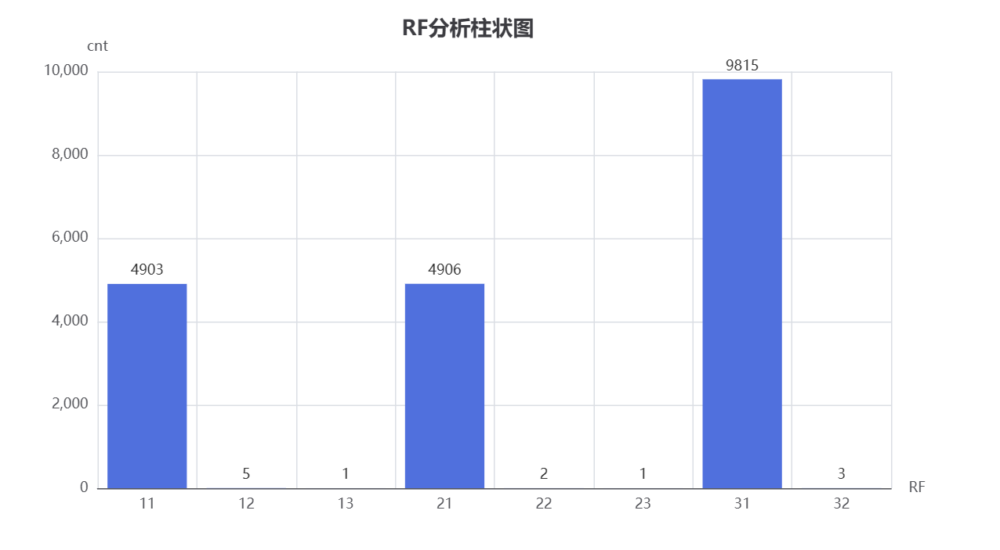

# 淘宝用户行为分析项目

## 项目背景

基于阿里天池淘宝用户行为数据集（抽取约100万条数据），分析用户购物行为模式。

## 分析维度

- **流量分析**：用户活跃时段分布
- **转化漏斗**：浏览→收藏→加购→购买转化率
- **商品分析**：Top10 热门商品
- **RF分群**：基于最近购买时间和购买频次的用户分层

## 技术栈

- 数据处理: Python、Pandas
- 可视化工具: Matplotlib、Pyecharts
- Web应用: Streamlit
- 数据库: MySQL
- 包管理工具: uv

## 功能展示

### 流量分析


### 热门商品TOP10


### 用户行为分布（原始为html）


### 转化漏斗（原始为html）


### RF（原始为html）



### 整体效果


## 项目结构

```
UserBehavior/
├── streamlitapp.py # 主应用入口
├── data_analysis.py # 数据分析主函数
├── src/ # 源代码目录
│ ├── csv_to_sql.py # 数据预处理模块
│ ├── analysis_funnel_pie.py # 漏斗图和饼图分析
│ ├── basic_analysis.py # 流量分析
│ ├── hot_analysis.py # 热门商品分析
│ ├── rfm_analysis.py # RFM分析
│ └── config.py # 配置文件
├── utils/ # 工具类
│ └── mysqlConnection.py # 数据库连接模块
└── data/ # 数据目录及Matplotlib与Pyecharts输出目录
```

## 运行方式

1. 安装依赖（二选一）
    - 使用uv sync
    - 使用pip install -r requirement.txt
    - 酌情使用镜像源
2. 下载[数据集](https://tianchi.aliyun.com/dataset/649)
3. 运行streamlit
    - 使用streamlit run streamlitapp.py

## 说明

- 数据集为[阿里天池淘宝用户购物行为数据集](https://tianchi.aliyun.com/dataset/649)
- 从一亿条数据中随机抽取一百万条作为数据集 random_state=22